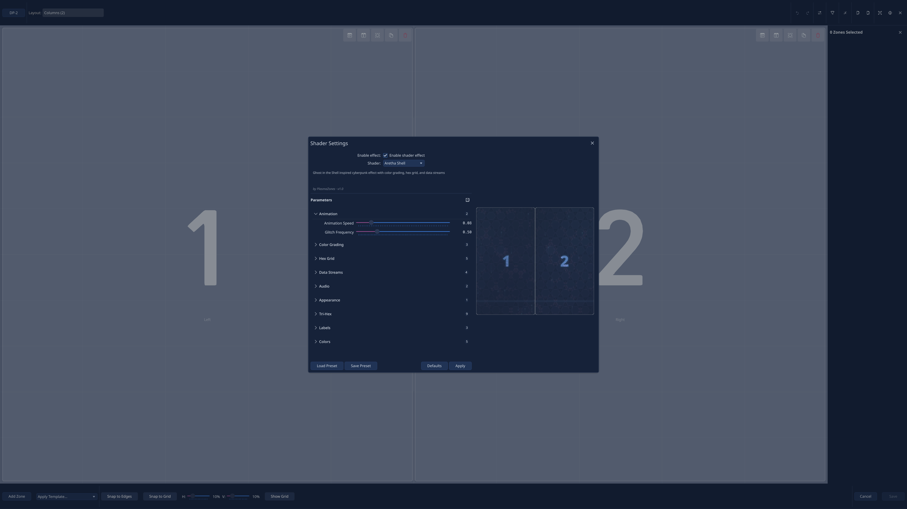
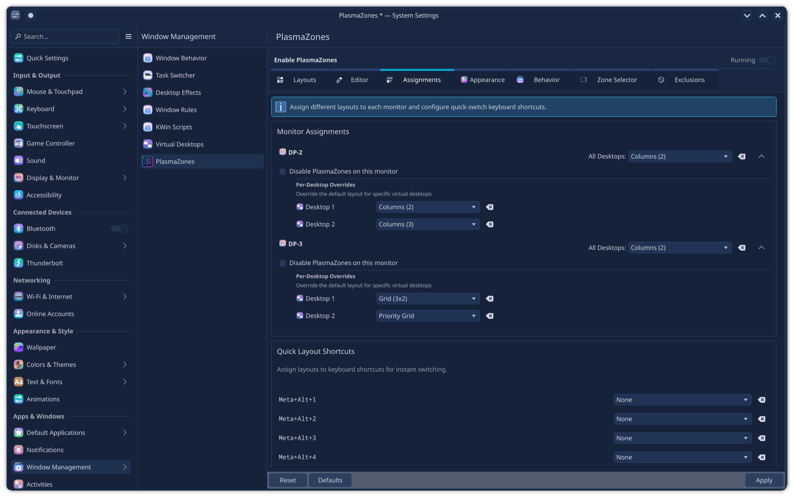
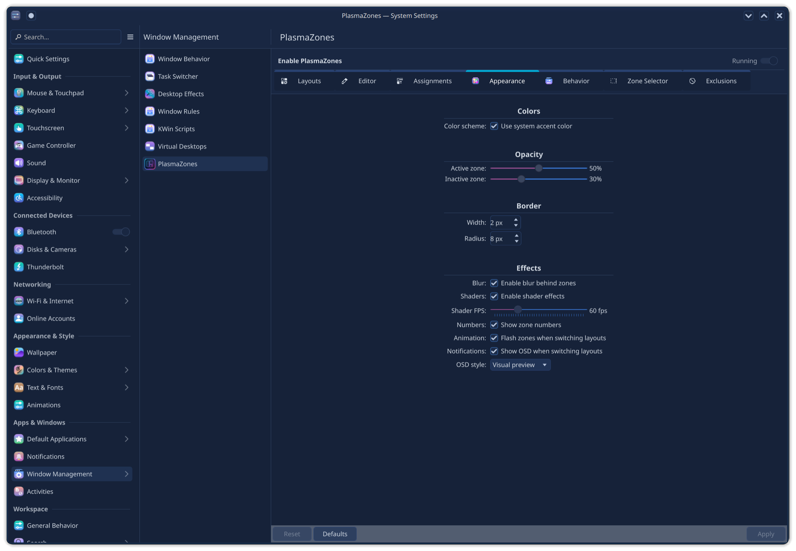
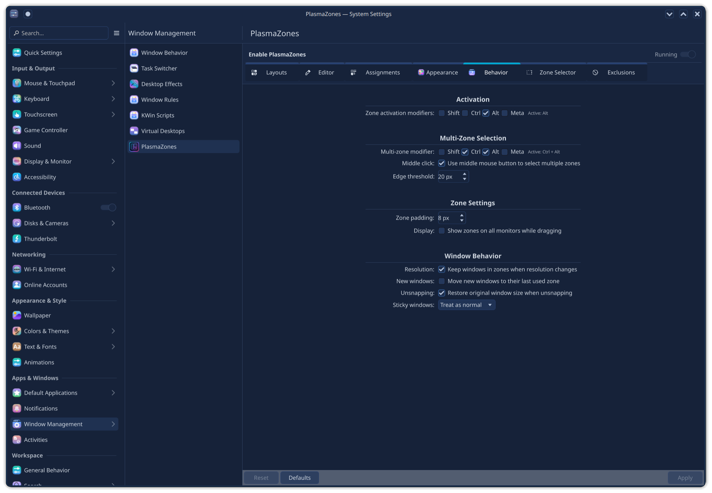
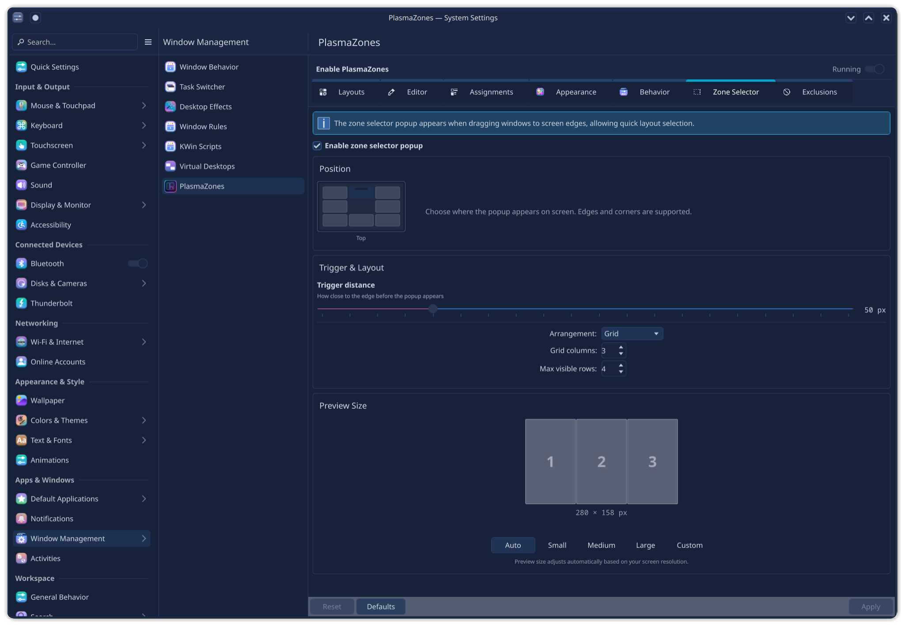
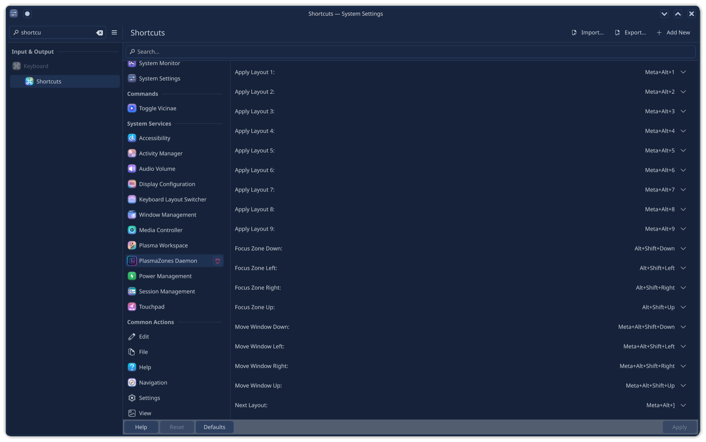

<div align="center">

# PlasmaZones


**FancyZones for KDE Plasma**

Define zones on your screen. Drag windows into them. Done.

<!-- TODO: Hero GIF showing drag-and-snap workflow -->
<!--  -->
*[Hero GIF placeholder - drag window → zones appear → snap]*

[](LICENSE)
[](https://kde.org/plasma-desktop/)

</div>

---

## How It Works

Hold **Alt** (or your configured modifier) while dragging a window. Zones light up. Drop the window into one and it resizes to fill that zone.

<!-- TODO: GIF of zones highlighted during drag -->
<!--  -->
*[GIF placeholder - window being dragged with zones highlighted]*

---

## Why PlasmaZones?

There are several window tiling options for KDE Plasma. Here's how PlasmaZones compares:

| Feature | PlasmaZones | KZones | MouseTiler | Polonium | Built-in Plasma |
|---------|:-----------:|:------:|:----------:|:--------:|:---------------:|
| Multiple saved layouts | ✅ | ✅ (JSON) | ❌ | ❌ | ❌ |
| Visual layout editor | ✅ | ❌ | ❌ | ❌ | ✅ (Meta+T) |
| GPU shader effects | ✅ (10+) | ❌ | ❌ | ❌ | ❌ |
| Full KCM integration | ✅ | ❌ | ❌ | ❌ | Partial |
| Per-virtual-desktop layouts | ✅ | ❌ | ❌ | ❌ | ❌ |
| Per-activity layouts | ✅ | ❌ | ❌ | ❌ | ❌ |
| Window session persistence | ✅ | ❌ | ❌* | ❌ | ❌ |
| Visual layout OSD | ✅ | OSD text | ❌ | ❌ | ❌ |
| Multi-zone spanning | ✅ | ✅ | ❌ | ❌ | ❌ |
| Keyboard navigation | ✅ | ✅ (14+) | Basic | ✅ | ✅ (6.3+) |
| Quick layout slots (1-9) | ✅ | ✅ | ❌ | ❌ | ❌ |
| D-Bus API | ✅ (80+) | ❌ | ❌ | ❌ | ❌ |
| Multi-monitor | ✅ | ✅ | ✅ | ✅ | ✅ |
| Native C++ performance | ✅ | ❌ | ❌ | ❌ | ✅ |
| Touch/stylus support | ❌ | ❌ | ✅ | ❌ | ❌ |
| Zone overlay | ✅ | ✅ | ✅ | ❌ | ✅ (Shift+drag) |
| Zone selector widget | ✅ | ✅ | ❌ | ❌ | ❌ |

*MouseTiler works with separate "Remember Window Positions" script for persistence

### Key Advantages

**vs KZones** — PlasmaZones is a native KWin effect (C++), not a JavaScript script. This means better performance, GPU-accelerated visuals, and deeper system integration. KZones requires manual JSON editing for layouts; PlasmaZones has a full visual editor. PlasmaZones also offers session persistence (windows restore to their zones after reboot), per-desktop layouts, and a complete D-Bus API.

**vs MouseTiler** — MouseTiler uses dynamic mouse-based tiling without predefined zones. PlasmaZones uses fixed zone layouts that you design once and reuse. MouseTiler is great for quick ad-hoc arrangements; PlasmaZones is better for consistent, repeatable workflows. MouseTiler has touch/stylus support; PlasmaZones has visual polish and advanced features.

**vs Polonium/Bismuth** — These are *automatic* tiling managers (like i3). PlasmaZones is *manual* zone-based snapping (like FancyZones). Different philosophies for different workflows. If you want windows to auto-arrange, use Polonium. If you want to define zones and drag windows into them, use PlasmaZones.

**vs Built-in Plasma Tiling** — Plasma 5.27+ introduced a visual tiling editor (Meta+T) with Shift+drag snapping. However, it only supports one layout per screen with no way to save/switch between multiple layouts. It also lacks window session persistence (windows don't restore to zones after reboot), per-desktop layouts, shader effects, and a zone selector. PlasmaZones fills these gaps while integrating seamlessly with the Plasma experience.

---

## Features

### Window Snapping

- Drag with modifier to snap windows to zones
- Move windows between zones with keyboard shortcuts
- Focus adjacent zones without mouse
- Push window to first empty zone
- Restore original size on unsnap
- Per-window floating toggle

<!-- TODO: GIF showing keyboard navigation between zones -->
<!--  -->
*[GIF placeholder - moving window between zones with Meta+Alt+Arrows]*

### Layout Editor

- Visual canvas for drawing zones
- Templates for common layouts (columns, grids, focus+stack)
- Undo/redo, copy/paste
- Grid and edge snapping
- Per-zone colors and styling

<!-- TODO: GIF of layout editor -->
<!--  -->
*[GIF placeholder - layout editor with zones being drawn]*

### Shader Effects

GPU-accelerated zone overlays with 8 built-in effects:

| Effect | Description |
|--------|-------------|
| Neon Glow | Glowing edges with bloom |
| Glass Morphism | Frosted glass blur |
| Minimalist | Clean, flat zones |
| Holographic | Iridescent shimmer |
| Gradient Mesh | Smooth color gradients |
| Liquid Warp | Fluid motion effect |
| Magnetic Field | Energy field lines |
| Particle Field | Floating particles |



Custom shaders supported - see [docs/shaders.md](docs/shaders.md).

### Zone Selector

Drag to screen edge to reveal a layout picker. Choose any layout and zone without cycling.

<!-- TODO: GIF of zone selector in action -->
<!--  -->
*[GIF placeholder - drag to edge → selector appears → pick zone]*

### Visual Layout OSD

See a preview of the layout when switching, not just text.


### Multi-Monitor & Virtual Desktops

- Per-monitor layouts (same or different)
- Per-virtual-desktop layouts
- Per-activity layouts (optional, requires KActivities)



### System Settings Integration

Full KCM module for configuration - no config file editing required.


<details>
<summary><b>More Settings Screenshots</b></summary>

#### Appearance
Customize zone visuals: shader effects, colors, opacity, border styles, and highlight animations.



#### Behavior
Configure drag modifiers, snap thresholds, auto-snap for new windows, and session persistence options.



#### Zone Selector
Set up the edge-triggered zone picker: trigger distance, display duration, and selector appearance.



#### Shortcuts
Configure all keyboard shortcuts for layout switching, window navigation, and editor access.



</details>

---

## Installation

### Requirements

- Qt 6.6+
- KDE Frameworks 6.0+
- LayerShellQt (required for Wayland)
- CMake 3.16+
- C++20 compiler

Optional:
- KF6::Activities for activity-based layouts

### Building

```bash
git clone https://github.com/fuddlesworth/PlasmaZones.git
cd PlasmaZones
mkdir build && cd build
cmake .. -DCMAKE_BUILD_TYPE=Release -DCMAKE_INSTALL_PREFIX=/usr
cmake --build . -j$(nproc)
sudo cmake --install .
```

Enable the daemon:

```bash
systemctl --user enable --now plasmazones.service
```

### Local Install (No Root)

```bash
cmake .. -DCMAKE_BUILD_TYPE=Release -DCMAKE_INSTALL_PREFIX=$HOME/.local
cmake --build . -j$(nproc)
cmake --install .
systemctl --user enable --now plasmazones.service
```

---

## Quick Start

1. Open **System Settings → PlasmaZones**
2. Enable the daemon (or run `systemctl --user enable --now plasmazones.service`)
3. Click **Open Editor** to create a layout
4. Draw zones or pick a template
5. Save with **Ctrl+S**
6. **Drag any window while holding Alt** - zones appear, drop to snap

---

## Keyboard Shortcuts

### Global Shortcuts

| Action | Default Shortcut |
|--------|------------------|
| Open editor | `Meta+Shift+E` |
| Previous layout | `Meta+Alt+[` |
| Next layout | `Meta+Alt+]` |
| Quick layout 1-9 | `Meta+Alt+1` through `Meta+Alt+9` |
| Snap to zone 1-9 | `Meta+Ctrl+1` through `Meta+Ctrl+9` |
| Move window left | `Meta+Alt+Shift+Left` |
| Move window right | `Meta+Alt+Shift+Right` |
| Move window up | `Meta+Alt+Shift+Up` |
| Move window down | `Meta+Alt+Shift+Down` |
| Focus zone left | `Alt+Shift+Left` |
| Focus zone right | `Alt+Shift+Right` |
| Push to empty zone | `Meta+Return` |
| Restore window size | `Meta+Escape` |
| Toggle float | `Meta+F` |

All shortcuts configurable in System Settings → Shortcuts → PlasmaZones.

### Editor Shortcuts

| Action | Shortcut |
|--------|----------|
| Save | `Ctrl+S` |
| Undo | `Ctrl+Z` |
| Redo | `Ctrl+Shift+Z` |
| Delete zone | `Delete` |
| Duplicate zone | `Ctrl+D` |
| Split horizontal | `Ctrl+Shift+H` |
| Split vertical | `Ctrl+Alt+V` |
| Move zone | `Arrow keys` |
| Resize zone | `Shift+Arrow keys` |

---

## Configuration

Settings available in **System Settings → PlasmaZones** or via:

```bash
systemsettings kcm_plasmazones
```

Layouts stored as JSON in `~/.local/share/plasmazones/layouts/`.

### D-Bus API

```bash
# List all layouts
qdbus org.plasmazones /PlasmaZones org.plasmazones.LayoutManager.getLayoutList

# Get active layout (returns JSON)
qdbus org.plasmazones /PlasmaZones org.plasmazones.LayoutManager.getActiveLayout

# Switch layout
qdbus org.plasmazones /PlasmaZones org.plasmazones.LayoutManager.setActiveLayout "{uuid}"

# Show/hide overlay
qdbus org.plasmazones /PlasmaZones org.plasmazones.Overlay.showOverlay
qdbus org.plasmazones /PlasmaZones org.plasmazones.Overlay.hideOverlay

# Get all screens
qdbus org.plasmazones /PlasmaZones org.plasmazones.ScreenManager.getScreens
```

Full API documentation in [docs/dbus-api.md](docs/dbus-api.md) covering all 7 interfaces and 80+ methods.

---

## Project Structure

```
src/
├── core/           # Zone, Layout, LayoutManager, ShaderRegistry
├── daemon/         # Background service, overlay windows
│   └── rendering/  # GPU rendering components
├── editor/         # Visual layout editor
│   ├── qml/        # Editor QML UI
│   ├── services/   # Editor services (snapping, templates)
│   └── undo/       # Undo/redo command system
├── dbus/           # D-Bus adaptors (7 interfaces)
├── config/         # Settings (KConfig)
├── ui/             # QML components (OSD, overlays, zone selector)
└── shared/         # Shared QML components and plugins
kcm/                # System Settings module (KCM)
└── ui/             # KCM QML pages
kwin-effect/        # KWin effect plugin (window tracking)
data/
├── layouts/        # Default layout templates
└── shaders/        # Built-in GLSL shader effects
tests/
├── unit/           # Unit tests
└── integration/    # Integration tests
dbus/               # D-Bus service files
icons/              # Application icons (hicolor)
po/                 # Translations
docs/               # Documentation
```

---

## Contributing

See [CONTRIBUTING.md](CONTRIBUTING.md) for guidelines.

---

## Support

If PlasmaZones is useful to you, consider supporting development:

- [Ko-fi](https://ko-fi.com/fuddlesworth)
- [GitHub Sponsors](https://github.com/sponsors/fuddlesworth)

---

## License

GPL-3.0-or-later

---

<div align="center">

Inspired by [FancyZones](https://learn.microsoft.com/en-us/windows/powertoys/fancyzones) from PowerToys.

**Made for KDE Plasma 6**

</div>
