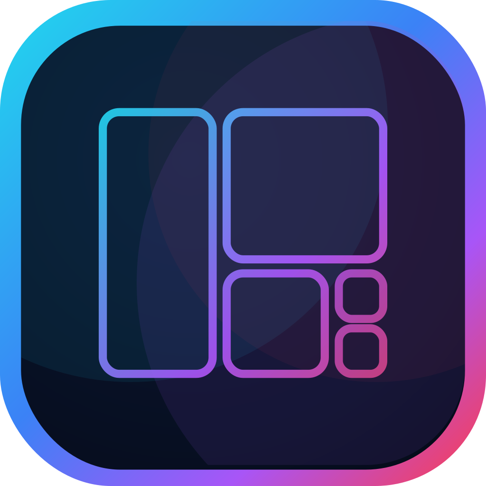
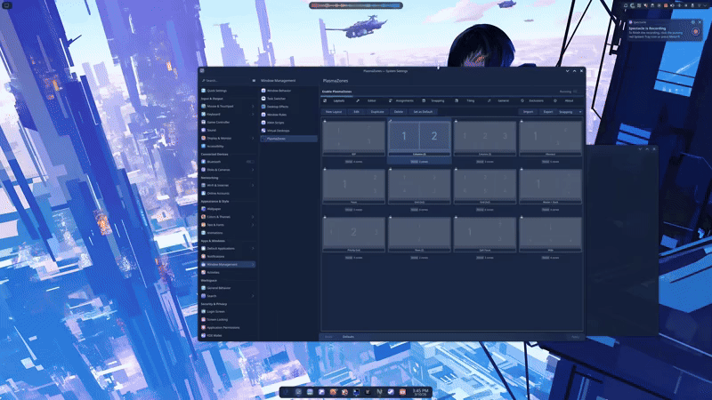
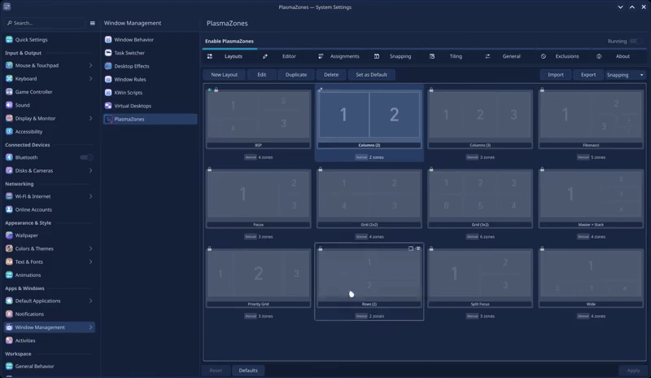

<div align="center">

# PlasmaZones



**Window zone management for Wayland compositors**

Define zones on your screen. Drag windows into them. Done.

[](https://github.com/fuddlesworth/PlasmaZones/actions/workflows/ci.yml)
[](https://github.com/fuddlesworth/PlasmaZones/releases/latest)
[](https://aur.archlinux.org/packages/plasmazones-bin)
[](https://copr.fedorainfracloud.org/coprs/fuddlesworth/PlasmaZones/package/plasmazones/)
<br>
[](LICENSE)
[](https://wayland.freedesktop.org/)

</div>

---

## Table of Contents

- [How It Works](#how-it-works)
- [Features](#features)
  - [Window Snapping](#window-snapping)
  - [Autotiling](#autotiling)
  - [Shader Effects](#shader-effects)
- [Installation](#installation)
- [Quick Start](#quick-start)
- [Keyboard Shortcuts](#keyboard-shortcuts)
- [Configuration](#configuration)
- [Troubleshooting](#troubleshooting)
- [D-Bus API](#d-bus-api)
- [Project Structure](#project-structure)
- [Contributing](#contributing)
- [Support](#support)

---

## How It Works

Hold **Alt** (or your configured modifier) while dragging a window. Zones light up. Drop the window into one and it resizes to fill that zone.

<p align="center">
  
</p>

---

## Features

### Window Snapping

**Snapping**
- Drag with modifier key or mouse button to snap windows to zones
- Always-active mode: zones activate on every drag without a modifier
- Enable/disable snapping globally
- Snap all visible windows to zones at once
- Auto-assign windows to first empty zone per layout
- Snap to multiple zones at once
- App-to-zone rules: auto-snap apps to specific zones on launch

**Movement**
- Move windows between zones with keyboard shortcuts
- Swap windows between zones directionally
- Rotate windows clockwise/counterclockwise through zones
- Push window to first empty zone
- Restore original size on unsnap
- Per-window floating toggle
- Staggered animations with elastic and bounce easing curves

**Focus & Cycling**
- Focus adjacent zones without mouse
- Cycle through windows stacked in the same zone

<p align="center">
  
</p>

### Layout Editor

- Visual canvas for drawing and resizing zones
- 12 built-in templates (columns, grids, fibonacci, master-stack, focus+stack, and more)
- Undo/redo, copy/paste, cut, duplicate
- Split zones horizontally or vertically
- Grid and edge snapping
- Fill available space / auto-expand
- Fullscreen editing mode
- Per-zone colors and styling
- Restrict layouts to specific screens, desktops, or activities

<p align="center">
  
</p>

### Autotiling

Enable autotiling per-screen and windows arrange themselves using one of 11 algorithms:

| Algorithm | Description |
|-----------|-------------|
| Master+Stack | Main window with a stack beside it |
| Centered Master | Main window centered, stacks on both sides |
| Three Column | Even three-column split |
| Columns | Equal vertical columns |
| Rows | Equal horizontal rows |
| Grid | Automatic grid arrangement |
| Dwindle | Recursive halving, alternating direction |
| Spiral | Recursive halving in a spiral |
| BSP | Binary space partitioning |
| Wide | Horizontal main area with stacked columns below |
| Monocle | One window at a time, cycle between them |

- Per-screen algorithm selection with independent settings
- Configurable master ratio and master count (separate settings for Centered Master vs Master+Stack)
- Inner and outer gaps with per-side control (top/bottom/left/right)
- Smart gaps — no gaps when only one window is tiled
- Max windows cap — overflow windows float automatically
- Hide title bars on tiled windows, with colored borders
- Window insertion position: end, after focused, or as master
- Focus follows mouse and focus new windows
- Minimized windows float, unminimized windows rejoin tiling
- Per-window floating toggle
- Staggered tiling animations
- Respect window minimum sizes (toggleable) — tiles expand to honor size hints reported by the application

> **Tip:** Some apps enforce a minimum size that prevents tiles from reaching their intended geometry. To fix this, create a KWin Window Rule:
> **System Settings → Window Management → Window Rules** → add a rule matching the window class, set **Minimum Size** to **Force** `0×0` under the **Size & Position** tab. This removes the constraint so PlasmaZones can tile the window at any size.

<p align="center">
  
</p>

### Shader Effects

14 built-in GLSL shader effects for zone overlays, including audio-reactive visuals:

| Effect | Description |
|--------|-------------|
| Aretha Shell | Cyberpunk hex grid with data streams |
| Berry Drift | Metaball blobs in berry and violet tones |
| CachyOS Drift | Crystalline drift with domain-warped FBM and iridescent glow |
| Cosmic Flow | Fractal noise with animated colors |
| Liquid Canvas | Wallpaper as a liquid painting with flow distortion |
| Magnetic Field | Mouse-reactive field with orbiting particles |
| Mosaic Pulse | Audio-reactive stained glass mosaic |
| Nexus Cascade | Plasma with distortion, bloom, and chromatic aberration |
| Prismata | Prismatic facets with audio-reactive chromatic fracture |
| Sonic Ripple | Audio-reactive concentric rings with bass shockwaves |
| Spectrum Bloom | Polar contour with frequency-driven shape morphing |
| Spectrum Pulse | Audio-reactive neon energy with CAVA integration |
| Toxic Circuit | Glowing circuit traces with digital corruption |
| Voxel Terrain | Infinite 3D voxel world with neon edges and audio-reactive glow |

Up to 4 custom image textures per shader, plus desktop wallpaper sampling.

<p align="center">
  
</p>

Custom shaders supported — see the [Shader Guide](https://github.com/fuddlesworth/PlasmaZones/wiki/Shaders) on the wiki.

### Snap Assist

After snapping a window, an overlay shows the remaining empty zones with thumbnails of other windows. Click a thumbnail to snap it into a zone.

<p align="center">
  
</p>

### Zone Selector

Drag to screen edge to reveal a layout picker. Jump straight to any layout and zone.

<p align="center">
  
</p>

### Layout Picker

Press `Meta+Alt+Space` to open a fullscreen layout picker. Click any layout to switch.

<p align="center">
  
</p>

### Visual Layout OSD

See a preview of the layout when switching, not just text.

<p align="center">
  
</p>

### Navigation OSD

Move, focus, swap, rotate, and push actions show a brief overlay with the affected zone numbers.

<p align="center">
  
</p>

### Multi-Monitor & Virtual Desktops

- Per-monitor layouts (same or different)
- Per-virtual-desktop layouts
- Per-activity layouts (optional, requires PlasmaActivities)
- Per-monitor zone selector settings
- Per-screen shader selection
- Screen-targeted app-to-zone rules

### Settings App

Standalone settings app (`plasmazones-settings`) with sidebar navigation:

- **Overview** — Per-screen mode (snapping/tiling) with live context display
- **Layouts** — Create, duplicate, import/export zone layouts with 26 templates
- **Snapping** — Activation, zone appearance (colors, opacity, borders, blur, shaders), animations, zone selector, per-monitor/desktop/activity assignments
- **Tiling** — Per-screen algorithm selection, master ratio/count, gaps, title bar hiding, insertion order, focus behavior, per-monitor/desktop/activity assignments
- **General** — OSD style, layout switch notifications, global behavior, editor shortcuts
- **Exclusions** — Window class exclusion lists with interactive picker, minimum size thresholds

On KDE Plasma, a System Settings entry provides version info and a launcher to the settings app.

<p align="center">
  
</p>

---

## Installation

### Requirements

- Any Wayland compositor with layer-shell support
- Qt 6.6+
- LayerShellQt 6.6+
- CMake 3.16+
- C++20 compiler

Optional (for full KDE integration):
- KDE Frameworks 6.6+ (KWin effect, System Settings, KGlobalAccel shortcuts)
- PlasmaActivities (activity-based layouts)

### Arch Linux (AUR)

```bash
# Binary package (prebuilt)
yay -S plasmazones-bin

# Source package (builds locally)
yay -S plasmazones
```

### Fedora (COPR)

```bash
sudo dnf copr enable fuddlesworth/PlasmaZones
sudo dnf install plasmazones
```

### openSUSE Tumbleweed (OBS)

Community-maintained package by [ilFrance](https://build.opensuse.org/package/show/home:ilFrance/plasmazones):

```bash
sudo zypper addrepo https://download.opensuse.org/repositories/home:ilFrance/openSUSE_Tumbleweed/home:ilFrance.repo
sudo zypper refresh
sudo zypper install plasmazones
```

> **Note:** Do not use the Fedora RPM on openSUSE — it has incompatible Qt private API dependencies.

### Nix

```bash
nix profile install github:fuddlesworth/PlasmaZones
```

Or add to your flake inputs. A `flake.nix` is included in the repository.

### Building from Source

```bash
git clone https://github.com/fuddlesworth/PlasmaZones.git
cd PlasmaZones
cmake -B build -DCMAKE_BUILD_TYPE=Release -DCMAKE_INSTALL_PREFIX=/usr
cmake --build build -j$(nproc)
sudo cmake --install build
```

**Portable build (no KDE dependencies):**

```bash
cmake -B build -DUSE_KDE_FRAMEWORKS=OFF \
    -DCMAKE_BUILD_TYPE=Release -DCMAKE_INSTALL_PREFIX=/usr
cmake --build build -j$(nproc)
sudo cmake --install build
```

This builds only the daemon and editor — no KWin effect or KCM.
See [Compositor Integration](docs/compositor-integration.md) for
shortcut and config setup on non-KDE compositors.

After installation, enable the daemon:

```bash
systemctl --user enable --now plasmazones.service
```

On KDE Plasma, also refresh the service cache for KCM:

```bash
kbuildsycoca6 --noincremental
```

Open the settings app:

```bash
plasmazones-settings
```

On KDE Plasma, PlasmaZones also appears in **System Settings → Window Management → PlasmaZones** with a launcher to the settings app.

<details>
<summary>Local install (no root)</summary>

```bash
cmake .. -DCMAKE_BUILD_TYPE=Release -DCMAKE_INSTALL_PREFIX=$HOME/.local
cmake --build . -j$(nproc)
cmake --install .
```

Add these to your `~/.bashrc` or `~/.zshrc`:

```bash
export QT_PLUGIN_PATH=$HOME/.local/lib/qt6/plugins:$QT_PLUGIN_PATH
export QML2_IMPORT_PATH=$HOME/.local/lib/qt6/qml:$QML2_IMPORT_PATH
export XDG_DATA_DIRS=$HOME/.local/share:$XDG_DATA_DIRS
```

Then reload your shell and refresh the cache:

```bash
source ~/.bashrc  # or ~/.zshrc
kbuildsycoca6 --noincremental
systemctl --user enable --now plasmazones.service
```

</details>

<details>
<summary>RPM-based distros (Fedora/openSUSE)</summary>

An RPM spec is included in `packaging/rpm/plasmazones.spec` for building packages on Fedora, openSUSE, and other RPM-based distributions.

</details>

<details>
<summary>Universal Linux / Fedora Atomic (Portable Tarball)</summary>

For distributions where installing system packages is difficult (Fedora Atomic/Silverblue) or if you lack root privileges:

1. Download `plasmazones-linux-x86_64.tar.gz` from the [Latest Release](https://github.com/fuddlesworth/PlasmaZones/releases/latest).
2. Extract the archive.
3. Run the installer script:

```bash
tar xzf plasmazones-linux-x86_64.tar.gz
cd plasmazones-linux-x86_64
./install.sh
```

The script installs PlasmaZones to `~/.local` and sets up your environment variables.

**Or use the one-liner:**

```bash
bash <(curl -s https://raw.githubusercontent.com/fuddlesworth/PlasmaZones/main/packaging/local-install/web-install.sh)
```

**Upgrading:**

Run the installer again with a newer tarball. It will detect the existing installation and upgrade in place.

**Uninstalling:**

```bash
~/.local/share/plasmazones/uninstall.sh
```

</details>

---

## Quick Start

1. Enable the daemon: `systemctl --user enable --now plasmazones.service`
2. Open settings: `plasmazones-settings` (or **System Settings → PlasmaZones** on KDE)
3. Click **Open Editor** to create a layout
4. Draw zones or pick a template
5. Save with **Ctrl+S**
6. **Drag any window while holding Alt** — zones appear, drop to snap

> **Tip:** The settings app works on any compositor. On KDE, it also appears in System Settings.

---

## Keyboard Shortcuts

### Global Shortcuts

All configurable in **System Settings → Shortcuts → PlasmaZones** (KDE) or in the PlasmaZones settings app.

<details>
<summary>Layout switching</summary>

| Action | Default Shortcut |
|--------|------------------|
| Previous layout | `Meta+Alt+[` |
| Next layout | `Meta+Alt+]` |
| Quick layout 1–9 | `Meta+Alt+1` through `Meta+Alt+9` |
| Open layout picker | `Meta+Alt+Space` |
| Resnap windows to new layout | `Meta+Ctrl+Z` |

</details>

<details>
<summary>Window movement & snapping</summary>

| Action | Default Shortcut |
|--------|------------------|
| Snap to zone 1–9 | `Meta+Ctrl+1` through `Meta+Ctrl+9` |
| Move window left/right/up/down | `Meta+Alt+Shift+Arrow` |
| Swap window left/right/up/down | `Meta+Ctrl+Alt+Arrow` |
| Push to empty zone | `Meta+Alt+Return` |
| Snap all windows to zones | `Meta+Ctrl+S` |
| Restore window size | `Meta+Alt+Escape` |
| Toggle float | `Meta+F` |

</details>

<details>
<summary>Focus & cycling</summary>

| Action | Default Shortcut |
|--------|------------------|
| Focus zone left/right/up/down | `Alt+Shift+Arrow` |
| Cycle window forward | `Meta+Alt+.` |
| Cycle window backward | `Meta+Alt+,` |
| Rotate windows clockwise | `Meta+Ctrl+]` |
| Rotate windows counterclockwise | `Meta+Ctrl+[` |

</details>

<details>
<summary>Autotiling</summary>

| Action | Default Shortcut |
|--------|------------------|
| Toggle autotile | `Meta+Shift+T` |
| Toggle float | `Meta+F` |
| Focus master window | `Meta+Shift+M` |
| Swap with master | `Meta+Shift+Return` |
| Increase master ratio | `Meta+Shift+L` |
| Decrease master ratio | `Meta+Shift+H` |
| Increase master count | `Meta+Shift+]` |
| Decrease master count | `Meta+Shift+[` |
| Retile windows | `Meta+Shift+R` |

</details>

<details>
<summary>Other</summary>

| Action | Default Shortcut |
|--------|------------------|
| Open editor | `Meta+Shift+E` |
| Open settings | `Meta+Shift+P` |
| Toggle layout lock | `Meta+Ctrl+L` |

</details>

**Shortcut pattern** (avoids conflicts with KDE defaults):
- `Meta+Alt+{key}` — Layout operations and actions
- `Meta+Alt+Shift+Arrow` — Zone movement (avoids KDE's `Meta+Shift+Arrow` screen movement)
- `Meta+Ctrl+Alt+Arrow` — Swap windows (avoids KDE's `Meta+Ctrl+Arrow` desktop switching)
- `Alt+Shift+Arrow` — Focus navigation (avoids KDE's `Meta+Arrow` quick tile)

### Editor Shortcuts

| Action | Shortcut |
|--------|----------|
| Save | `Ctrl+S` |
| Undo / Redo | `Ctrl+Z` / `Ctrl+Shift+Z` |
| Select all | `Ctrl+A` |
| Copy / Cut / Paste | `Ctrl+C` / `Ctrl+X` / `Ctrl+V` |
| Paste with offset | `Ctrl+Shift+V` |
| Delete zone | `Delete` |
| Duplicate zone | `Ctrl+D` |
| Split horizontal | `Ctrl+Shift+H` |
| Split vertical | `Ctrl+Alt+V` |
| Fill available space | `Ctrl+Shift+F` |
| Toggle fullscreen | `F11` |
| Move zone | `Arrow keys` |
| Resize zone | `Shift+Arrow keys` |
| Next / previous zone | `Ctrl+Tab` / `Ctrl+Shift+Tab` |

---

## Configuration

Open the settings app:

```bash
plasmazones-settings
```

Settings stored in `~/.config/plasmazonesrc`. Layouts stored as JSON in `~/.local/share/plasmazones/layouts/`.

---

## Troubleshooting

### PlasmaZones not appearing in System Settings (KDE only)

Refresh the KDE service cache after installing from source:

```bash
kbuildsycoca6 --noincremental
```

Or log out and back in. The standalone settings app is always available:

```bash
plasmazones-settings
```

### Daemon not starting

```bash
# Check status
systemctl --user status plasmazones.service

# View logs
journalctl --user -u plasmazones.service -f

# Restart
systemctl --user restart plasmazones.service
```

### Zones not appearing when dragging

1. Ensure daemon is running: `systemctl --user status plasmazones.service`
2. Check drag modifier in settings (default: Alt)
3. Verify you have at least one layout with zones
4. Check if the application is excluded in settings

---

## D-Bus API

PlasmaZones exposes 7 D-Bus interfaces for scripting and integration:

| Interface | Purpose |
|-----------|---------|
| `Autotile` | Autotiling engine control, algorithm selection, window float/unfloat |
| `LayoutManager` | Layout CRUD, screen/desktop/activity assignment, quick slots |
| `Overlay` | Zone overlay visibility, highlighting, zone detection, Zone Selector |
| `Screen` | Screen enumeration, geometry, scale, add/remove notifications |
| `Settings` | Configuration load/save/reset, get/set by key |
| `WindowDrag` | Window drag lifecycle from KWin, snap geometry response |
| `WindowTracking` | Window-to-zone tracking, pre-snap geometry, floating state |

```bash
# List all layouts
qdbus org.plasmazones /PlasmaZones org.plasmazones.LayoutManager.getLayoutList

# Get active layout (returns JSON)
qdbus org.plasmazones /PlasmaZones org.plasmazones.LayoutManager.getActiveLayout

# Switch layout
qdbus org.plasmazones /PlasmaZones org.plasmazones.LayoutManager.setActiveLayout "{uuid}"

# Show/hide overlay
qdbus org.plasmazones /PlasmaZones org.plasmazones.Overlay.showOverlay
qdbus org.plasmazones /PlasmaZones org.plasmazones.Overlay.hideOverlay

# Get all screens
qdbus org.plasmazones /PlasmaZones org.plasmazones.Screen.getScreens
```

Full API documentation: [wiki — D-Bus API](https://github.com/fuddlesworth/PlasmaZones/wiki/D-Bus-API)

---

## Project Structure

```
src/
├── autotile/           # Autotiling engine, per-screen config
│   └── algorithms/     # 14 tiling algorithms (master-stack, dwindle, bsp, etc.)
├── snap/               # Snap engine (zone matching, multi-zone selection)
├── core/               # Zone, Layout, LayoutManager, ShaderRegistry
│   ├── geometryutils/  # Geometry math helpers
│   ├── layout/         # Layout model and serialization
│   ├── layoutmanager/  # Layout lifecycle and assignment
│   ├── screenmanager/  # Screen tracking and resolution
│   ├── shaderregistry/ # Shader discovery and loading
│   └── windowtrackingservice/  # Window-to-zone tracking
├── daemon/             # Background service, overlay windows
│   ├── daemon/         # Startup, signals, navigation handlers
│   ├── overlayservice/ # Overlay window lifecycle
│   ├── rendering/      # GPU rendering (QRhi), label textures
│   └── shortcutmanager/  # Global shortcut handlers
├── editor/             # Visual layout editor
│   ├── qml/            # Editor QML UI
│   ├── controller/     # Editor operations (gaps, layout, selection, etc.)
│   ├── helpers/        # D-Bus queries, serialization, batch operations
│   ├── services/       # Snapping, templates, zone manager
│   └── undo/           # Undo/redo command system
├── dbus/               # D-Bus adaptors (7 interfaces)
├── config/             # Settings (QSettingsConfigBackend), update checker
├── ui/                 # QML components (OSD, overlays, zone selector)
└── shared/             # Shared QML components and plugins
kcm/                    # System Settings module (KCM) — About page + settings launcher
kwin-effect/            # KWin effect plugin
└── autotilehandler/    # Autotile event handling from KWin
data/
├── layouts/            # Default layout templates (12)
└── shaders/            # Built-in GLSL shader effects (13) + shared utilities
packaging/
├── arch/               # AUR PKGBUILD (source, binary, git)
├── debian/             # Debian packaging
├── local-install/      # Portable tarball installer
├── nix/                # Nix flake package
└── rpm/                # RPM spec
cmake/                  # CMake helpers (format-qml, uninstall)
tests/unit/             # Unit tests (autotile, config, core, helpers, ui)
dbus/                   # D-Bus XML interface definitions (7 interfaces)
icons/                  # Application icons (hicolor + hicolor-light)
translations/           # Qt Linguist translations (.ts/.qm)
docs/                   # Documentation and media
```

---

## Contributing

See [CONTRIBUTING.md](CONTRIBUTING.md) for guidelines on code style, license headers, testing, and translations.

---

## Support

If PlasmaZones is useful to you, consider supporting development:

- [Ko-fi](https://ko-fi.com/fuddlesworth)
- [GitHub Sponsors](https://github.com/sponsors/fuddlesworth)

Bug reports and feature requests: [GitHub Issues](https://github.com/fuddlesworth/PlasmaZones/issues)

---

## License

GPL-3.0-or-later

---

<div align="center">

Inspired by [FancyZones](https://learn.microsoft.com/en-us/windows/powertoys/fancyzones) from PowerToys.

**Works on KDE Plasma, Hyprland, Sway, GNOME, and any Wayland compositor with layer-shell support.**

</div>
