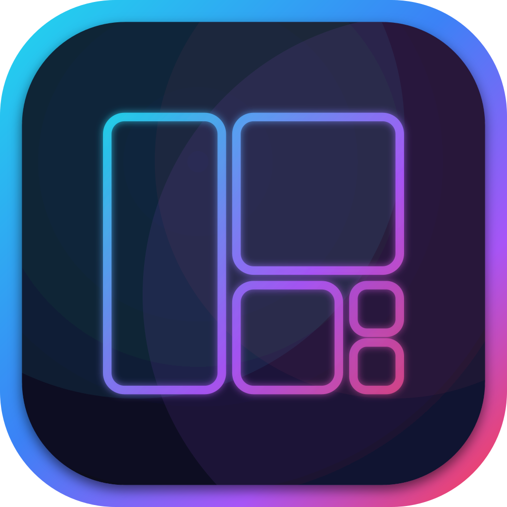
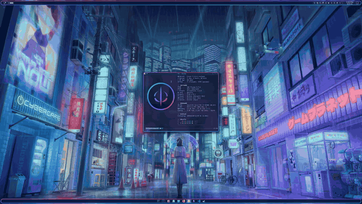
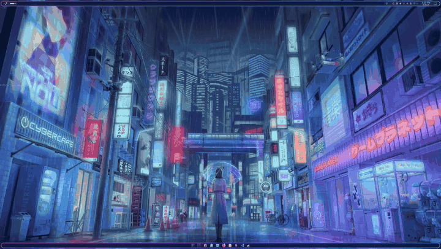
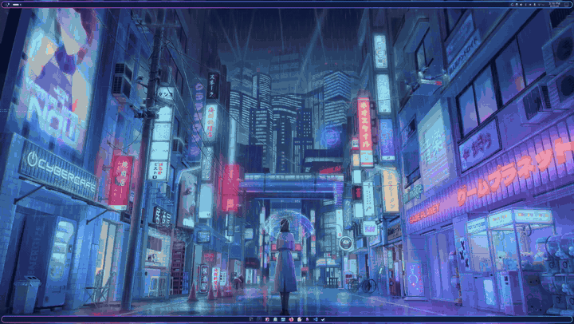

<div align="center">

# PlasmaZones



**Window snapping, tiling and scrolling for KDE Plasma**

Three placement modes in one daemon. Snap windows into zones you drew, let an algorithm tile them for you, or scroll them along an endless strip. Every monitor picks its own.

[](https://github.com/fuddlesworth/PlasmaZones/actions/workflows/ci.yml)
[](https://github.com/fuddlesworth/PlasmaZones/releases/latest)
[](https://aur.archlinux.org/packages/plasmazones-bin)
[](https://copr.fedorainfracloud.org/coprs/fuddlesworth/PlasmaZones/package/plasmazones/)
<br>
[](LICENSE)
[](https://wayland.freedesktop.org/)

**Docs and screenshots: [phosphor-works.github.io/plasmazones](https://phosphor-works.github.io/plasmazones/)**

</div>

---

## Three Placement Modes

Each monitor runs one mode, chosen per virtual desktop and per activity, so a widescreen can scroll while the laptop panel tiles. `Meta+Shift+T` cycles the focused screen through the enabled modes, and any mode can be turned off entirely.

### Snapping

Hold **Alt** (or your configured modifier) while dragging a window. The zones light up. Drop the window into one and it resizes to fill that zone.

<p align="center">
  
</p>

Zones are named regions you draw yourself, in a visual editor with drag-to-resize, snap-to-grid, and mirroring. A library of layouts ships built in (grids, BSP, master and stack, fibonacci, plus portrait, ultrawide, and super-ultrawide variants), and after a snap the remaining zones show as thumbnails so the next window is one click away. Zones can span, and keyboard users can skip the drag entirely with `Meta+Ctrl+1` through `Meta+Ctrl+9`.

[Layouts gallery →](https://phosphor-works.github.io/plasmazones/layouts/) · [Coming from FancyZones →](https://phosphor-works.github.io/plasmazones/from-fancyzones/)

### Tiling

<p align="center">
  
</p>

Windows place themselves as they open, with no drag and no zones to draw. The bundled algorithms are written in Luau and run in a sandbox, covering the usual master-and-stack, BSP, columns, grid, spiral, and monocle families along with less common ones. Write your own in the same language and the daemon hot-reloads it from disk while you edit.

[Autotile gallery →](https://phosphor-works.github.io/plasmazones/autotile/) · [Authoring guide →](https://phosphor-works.github.io/plasmazones/guides/tiling/)

### Scrolling

<p align="center">
  
</p>

Modeled on the [niri](https://github.com/YaLTeR/niri) compositor. Windows form columns on an endless strip and the screen is a window onto it, so opening a window never resizes the ones you already have. The strip slides them aside and scrolls the view instead.

Columns cycle through width presets or take any width you give them. Windows inside a column share it or show one at a time as tabs, with a configurable indicator alongside. A window can be consumed into its neighbor's column or expelled into its own, columns center on demand, and the strip runs side to side or top to bottom to match the shape of the monitor. Hold **Meta** and scroll the wheel to move along it. Templates set the starting columns and the presets each screen cycles through.

A shortcut family on `Meta+Alt` covers the whole vocabulary: [Keyboard shortcuts →](https://phosphor-works.github.io/plasmazones/shortcuts/)

---

## Beyond Placement

<!-- SHOWCASE GIF PLACEHOLDER — record the layout editor dragging zone boundaries. Produce with
     docs/media/videos/convert.sh and commit as docs/media/videos/editor.gif, then uncomment:
<p align="center">
  
</p>
-->

<!-- SHOWCASE GIF PLACEHOLDER — record a shader overlay running during a drag. Produce with
     docs/media/videos/convert.sh and commit as docs/media/videos/shaders.gif, then uncomment:
<p align="center">
  
</p>
-->

- **Appearance** — GLSL shader overlays for zones (audio-reactive, procedural, distro-themed) with up to 4 image textures each, window decoration packs, and animation packs for open, close, minimize, and desktop switching — [Shader gallery →](https://phosphor-works.github.io/plasmazones/shaders/) · [authoring guide →](https://phosphor-works.github.io/plasmazones/guides/shaders/)
- **Per-monitor, per-desktop, per-activity** — layouts, algorithms, templates, and mode assignments are all scoped, and virtual screens subdivide a physical monitor into independent logical workspaces with their own everything
- **Window rules** — match on class, title, active layout, screen orientation, and more, then act on placement, floating, opacity, borders, animations, scroll speed, and per-app behavior in every mode
- **Scriptable** — a D-Bus API on `org.plasmazones` covering every mode — [scripting guide →](https://phosphor-works.github.io/plasmazones/dbus/)

---

## Install

Arch (AUR, prebuilt):

```bash
yay -S plasmazones-bin
```

Fedora (COPR):

```bash
sudo dnf copr enable fuddlesworth/PlasmaZones && sudo dnf install plasmazones
```

Debian testing/unstable (apt):

```bash
curl -fsSL https://download.opensuse.org/repositories/home:fuddlesworth/Debian_Unstable/Release.key | gpg --dearmor | sudo tee /usr/share/keyrings/plasmazones.gpg > /dev/null
echo 'deb [signed-by=/usr/share/keyrings/plasmazones.gpg] https://download.opensuse.org/repositories/home:/fuddlesworth/Debian_Unstable/ /' | sudo tee /etc/apt/sources.list.d/plasmazones.list
sudo apt update && sudo apt install plasmazones
```

`signed-by` scopes the key to this repository, so it cannot sign anything from the Debian archive itself. The two URL spellings are both correct: the repository line uses `home:/fuddlesworth/` and the key uses `home:fuddlesworth/`, which is how OBS lays them out.

On Debian testing, swap `Debian_Unstable` for `Debian_Testing` in both lines. Packages are built for x86_64 only. The same repository works on Debian-derived rolling distributions such as PikaOS.

openSUSE Tumbleweed, a portable tarball for Fedora Atomic / no-root setups, and source-build instructions (including the `-DUSE_KDE_FRAMEWORKS=OFF` portable build): **[Install page →](https://phosphor-works.github.io/plasmazones/#install)**.

After install, enable the daemon:

```bash
systemctl --user enable --now plasmazones.service
kbuildsycoca6 --noincremental    # KDE only — refresh the service cache
```

Requirements: KDE Plasma 6.7+ on Wayland — the integration runs as a KWin effect, and KWin must be compositing with OpenGL — plus Qt 6.10+, CMake 3.16+, and a C++20 compiler. Kirigami is required for the settings app in every build. Optional: the rest of KDE Frameworks 6.26+ for the settings KCM and KGlobalAccel shortcuts, PlasmaActivities for activity-based layouts. The portable build (`-DUSE_KDE_FRAMEWORKS=OFF`) drops those optional framework deps.

### Nix / NixOS

#### NixOS (recommended)

Add to your flake inputs:

```nix
plasmazones.url = "github:fuddlesworth/PlasmaZones";
```

Import the module and enable it in your NixOS configuration:

```nix
imports = [ inputs.plasmazones.nixosModules.default ];
programs.plasmazones.enable = true;
```

After rebuilding, enable the daemon and refresh KDE:

```bash
systemctl --user enable --now plasmazones.service
kbuildsycoca6 --noincremental
```

Then log out and back in.

---

#### Nix profile (without NixOS)

```bash
nix profile install github:fuddlesworth/PlasmaZones
```

> **Note:** This pins the package to the flake's nixpkgs. If your system's KWin
> updates, the effect plugin may stop loading until you reinstall. The NixOS
> module method above avoids this by always building against your system's KWin.

---

## Quick Start

1. Enable the daemon: `systemctl --user enable --now plasmazones.service`
2. Open the settings app: `plasmazones-settings` (or **System Settings → Apps → PlasmaZones** on KDE)
3. Check that the effect is ticked in **System Settings → Window Management → Desktop Effects → PlasmaZones**. It is enabled by default, so this is usually just a confirmation. PlasmaZones runs as a KWin effect and needs KWin on OpenGL compositing, so the entry is unavailable under QPainter compositing.
4. **Drag any window while holding Alt** — zones appear, drop to snap.
5. To try the other modes, open **Overview** in the settings app and assign Tiling or Scrolling to a screen, or press `Meta+Shift+T` to cycle the focused one through the enabled modes.

Full first-run tour: **[Getting started →](https://phosphor-works.github.io/plasmazones/getting-started/)**.

---

## Shortcuts

| Action | Default |
|---|---|
| Open editor | `Meta+Shift+E` |
| Open settings | `Meta+Shift+P` |
| Cycle placement mode (snapping / tiling / scrolling) | `Meta+Shift+T` |
| Toggle floating | `Meta+F` |
| Restore window size | `Meta+Alt+Escape` |
| Snapping: snap window to zone 1–9 | `Meta+Ctrl+1` … `Meta+Ctrl+9` |
| Previous / next layout | `Meta+Alt+[` / `Meta+Alt+]` |
| Open layout picker | `Meta+Alt+Space` |
| Scrolling: consume / expel window | `Meta+Alt+I` / `Meta+Alt+Shift+I` |
| Scrolling: cycle column width forward / back | `Meta+Alt+PgUp` / `Meta+Alt+PgDown` |
| Scrolling: windowed fullscreen | `Meta+Alt+Shift+F` |
| Open shortcut cheatsheet | `Meta+Alt+/` |

Full reference, across core actions, zone movement, snap, layouts, autotile, scrolling, virtual screens, and the editor: **[Keyboard shortcuts →](https://phosphor-works.github.io/plasmazones/shortcuts/)**.

All bindings are rebindable in **System Settings → Shortcuts → PlasmaZones** (KDE). The PlasmaZones settings app rebinds only the layout editor's own shortcuts.

---

## Configuration

Settings live in `~/.config/plasmazones/config.json`. Layouts live in `~/.local/share/plasmazones/layouts/`. Everything is edited through the settings app:

```bash
plasmazones-settings                           # overview
plasmazones-settings -p snapping-layouts       # jump straight to the snapping layout library
plasmazones-settings --page tiling-behavior
plasmazones-settings --page scrolling-templates
```

The app is single-instance — launching it again while running raises the existing window and switches to the requested page.

---

## Troubleshooting

Daemon startup, verbose logging, KWin minimum-size rules, and the full support-report flow: **[Troubleshooting →](https://phosphor-works.github.io/plasmazones/troubleshooting/)**.

**Better Blur DX:** the force-blur mode blurs every window not on its allowlist, which catches PlasmaZones' overlay surfaces and makes the screen look blurred all the time. To fix it, open System Settings → Window Management → Desktop Effects → Better Blur DX → Configure → **Force blur** tab, select **"Blur all except matching"**, then add this line:

```text
/^plasmazones/
```

The slashes are required, they put the parser into regex mode. One entry covers the daemon, editor, and settings. The "Blur all except matching" toggle is the important part. The default mode treats the list as a whitelist instead of an exclusion list.

When filing a bug, attach a support report:

```bash
plasmazones-report
```

The archive lands in `/tmp` by default with home paths redacted, so it's safe to attach to a public issue.

---

## D-Bus API

The daemon exposes its whole surface on `org.plasmazones` for scripting and integration. Interface inventory, scripting recipes, and signal watching: **[D-Bus scripting guide →](https://phosphor-works.github.io/plasmazones/dbus/)**.

---

## Project Structure

Directory tree and data locations: [Project Structure](https://github.com/fuddlesworth/PlasmaZones/wiki/Project-Structure) on the wiki.

---

## Contributing

See [CONTRIBUTING.md](CONTRIBUTING.md) for guidelines on code style, license headers, testing, and translations.

---

## Support

If PlasmaZones is useful to you, consider supporting development:

- [Ko-fi](https://ko-fi.com/fuddlesworth)
- [GitHub Sponsors](https://github.com/sponsors/fuddlesworth)

Bug reports and feature requests: [GitHub Issues](https://github.com/fuddlesworth/PlasmaZones/issues)

---

## License

GPL-3.0-or-later

---

<div align="center">

Snapping is inspired by [FancyZones](https://learn.microsoft.com/en-us/windows/powertoys/fancyzones) from PowerToys. Scrolling is inspired by [niri](https://github.com/YaLTeR/niri).

**Built for KDE Plasma 6 on Wayland.**

</div>
